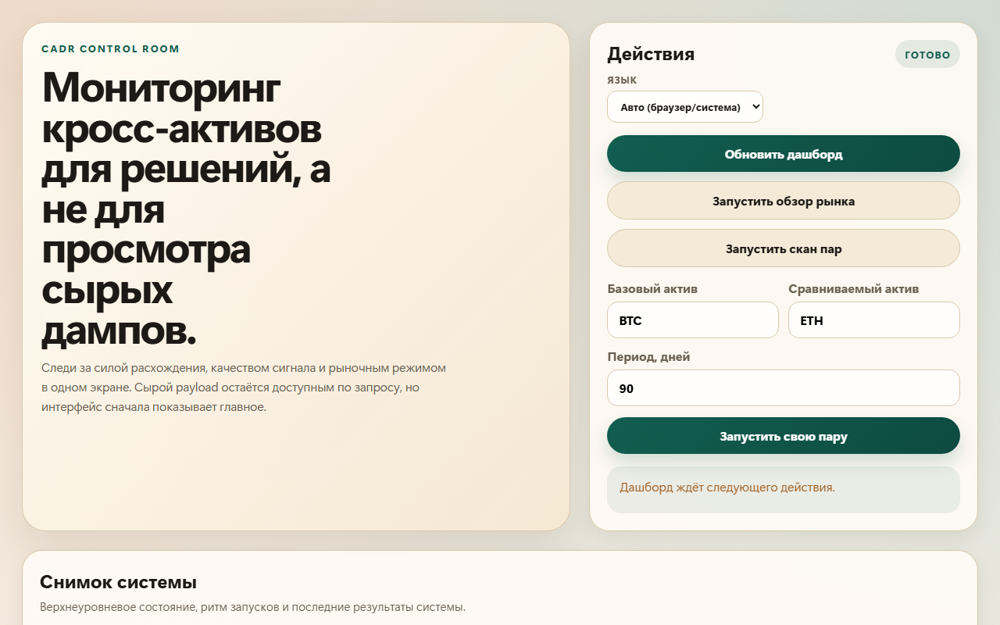

# Cross-Asset Divergence & Rotation (CADR) Strategy Skill

This repository contains the **CADR** strategy skill for AI Agents, built for the **BNB Hack 2026**.

## Overview



The CADR skill allows AI agents to detect cross-asset divergences between cryptocurrency pairs (e.g., BTC/ETH) and generate robust, backtestable mean-reversion trading strategy specifications. It relies entirely on CoinMarketCap data via the CMC API and MCP Server.

## Features

- **CMC Agent Hub First**: Uses CMC MCP tools for quotes, technicals, narratives, macro events, news, derivatives, and market-wide context.
- **Agentic Pair Selection**: Scores divergence opportunities using relative performance, RSI/MACD dislocation, narrative overlap, and macro regime.
- **Regime Awareness**: Classifies market regimes (Risk On, Risk Off, Crisis) using Fear & Greed and Bitcoin dominance heuristics.
- **Dynamic Risk Management**: Adjusts position sizing and stop-loss levels based on market regime and signal conviction.
- **Backtesting Engine**: Supports optional backtests with mark-to-market equity tracking and end-of-period liquidation when historical price series are available.
- **Structured Output**: Emits strategy specs with evidence, invalidation criteria, catalysts, thresholds, and market context.
- **Background Watchlist Monitoring**: Tracks a configurable default pair set every few minutes and keeps the latest signal state warm in the dashboard.
- **Forecast Journal**: Saves real entry checkpoints for strong signals, exports them to JSON, and supports next-day validation of whether the pair call actually worked.
- **Resilient Data Transport**: Adds retry/backoff-aware CMC REST and Skill Hub calls so scans fail less often under temporary API issues.
- **More Realistic Backtests**: Includes configurable fees, slippage, and short borrow drag in backtest outputs.

## Setup

1. Install requirements:
   ```bash
   pip install -r requirements.txt
   ```
   The project expects `pydantic` v2 APIs.

2. Configure CoinMarketCap Agent Hub / CMC MCP using the example config in [cmc_mcp_config.example.json](/D:/CADR/cmc_mcp_config.example.json:1). The MCP endpoint from CMC docs is:
   ```json
   {
     "mcpServers": {
       "cmc-mcp": {
         "url": "https://mcp.coinmarketcap.com/mcp",
         "headers": {
           "X-CMC-MCP-API-KEY": "your-api-key"
         }
       }
     }
   }
   ```

3. For REST fallback mode only, copy `.env.example` to `.env` and add your CoinMarketCap Pro API Key.
   ```bash
   cp .env.example .env
   ```

## Usage

Agents can trigger this skill using the workflow defined in [SKILL.md](/D:/CADR/SKILL.md:1).

For an agent-native demonstration that mirrors CMC MCP payloads:

```bash
python examples/run_agent_workflow.py
```

For a live CoinMarketCap Skill Hub run using `find_skill` + `execute_skill`:

```bash
python examples/run_skill_hub_daily_market.py
```

For the local monitoring and control dashboard:

```bash
python examples/run_dashboard.py
```

Then open `http://127.0.0.1:8010` by default.

The dashboard now supports:

- Editing the default watchlist directly from the UI.
- Background monitoring every `CADR_MONITOR_INTERVAL_SEC` seconds.
- Saving entry checkpoints for high-z-score signals into `CADR_FORECAST_EXPORT_PATH`.
- Re-checking due forecasts after the configured `CADR_FORECAST_HORIZON_HOURS`.

The REST and backtest layers are also configurable through `.env`:

- `CMC_API_TIMEOUT_SEC`, `CMC_API_RETRY_COUNT`, `CMC_API_RETRY_BACKOFF_SEC`, `CMC_API_MIN_INTERVAL_SEC`
- `CMC_SKILL_HUB_RETRY_COUNT`, `CMC_SKILL_HUB_RETRY_BACKOFF_SEC`
- `BACKTEST_FEE_BPS_PER_LEG`, `BACKTEST_SLIPPAGE_BPS_PER_LEG`, `BACKTEST_BORROW_BPS_DAILY`

For the REST fallback pipeline:

```bash
python examples/run_strategy.py
```

## Project Structure

- `SKILL.md`: The MCP-first skill manifest and workflow for CoinMarketCap Agent Hub.
- `cmc_mcp_config.example.json`: Example MCP client configuration for the CMC Agent Hub endpoint.
- `cadr/`: The core Python package containing the data layer, analysis engine, strategy generator, and backtester.
- `cadr/skill_hub/`: A Skill Hub client and pipeline layer for `find_skill` / `execute_skill`.
- `cadr/agent/`: The agent orchestration layer that converts CMC MCP snapshots into strategy specs.
- `cadr/dashboard/`: FastAPI, SQLite, and a local web UI for monitoring runs and controlling scans.
- `examples/`: Example scripts showing how to use the package.
- `tests/`: Unit tests for the core logic.

## License
MIT
